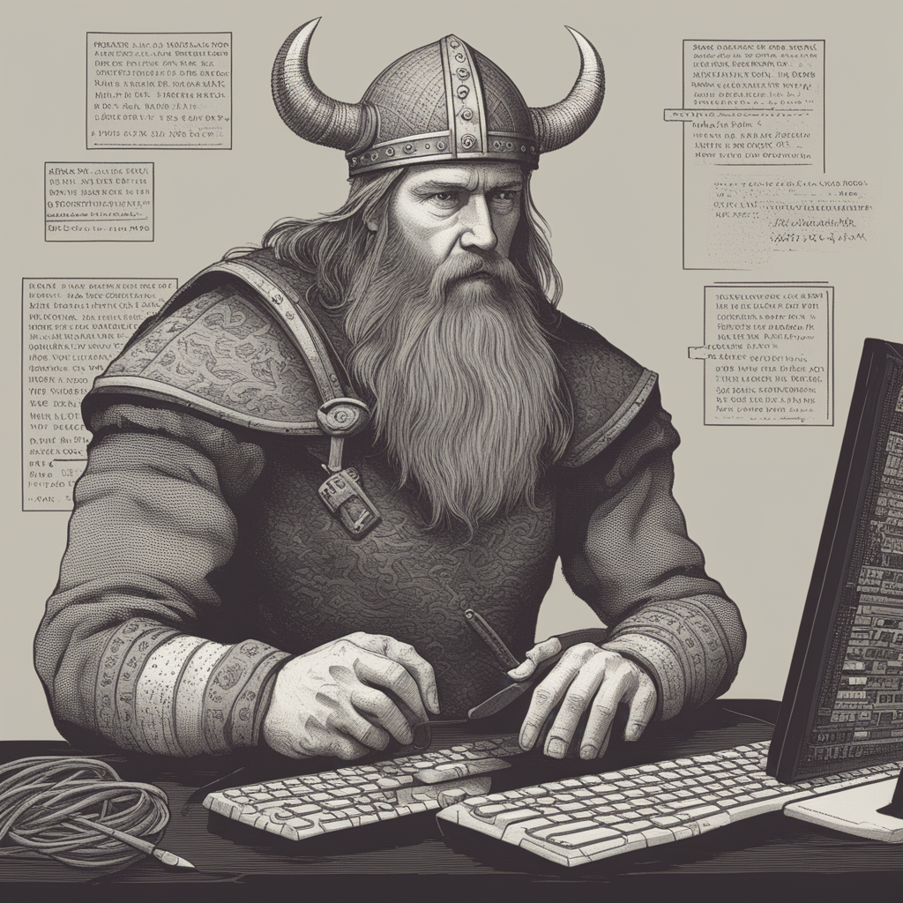

## Wellcome to my repository! 👋

### About me:
- 🌱 I’m currently learning everything in ML & AI 
- 👯 I’m looking to collaborate with other developers
- 🥅 Personal Goals: Learning how to learn
- ⚡ Fun: I have a joke about deep learning but I can't explain it. 
 

### Languages and Tools:
<!-- Python -->
[][python]
<!-- R -->
[][R]
<!-- postgreSQL -->
[][sql]
<!-- MySQL -->
[][mysql]
<!-- MongoDB -->
<!-- [][mongodb] -->
<!-- Git -->
[][git]
<!-- GitHub -->
<!-- [][github] -->
<!-- HTML5 -->
[][html5]
<!-- CSS3 -->
[][css3]
<!-- bash -->
[][bash]
<!-- tensorflow -->
[][tensorflow]
<!-- keras -->
[][keras]
<!-- Pytorch -->
[][pytorch]
<!-- scikit-learn -->
[][scikit-learn]
<!-- H2o -->
<!-- [][h2o] -->
<!-- Jupyter Notebook -->
[][Jupyter Notebook]
<!-- Streamlit -->
[][Streamlit]
<!-- Langchain -->
[][Langchain]
<!-- Streamlit -->
[][Huggingface]

 
<!-- laguage/skill -->
<!-- language/skill -->
<!-- language/skill -->
<!-- language/skill -->
 
 
 

### Connect with me:
[][linkedin]
 
 

[img]: https://som.yale.edu/sites/default/files/event-image.jpg
[linkedin]: https://www.linkedin.com/in/andreas-christopoulos-charitos-63382268/
[python]: https://www.python.org/
[R]: https://www.r-project.org/
[sql]: https://en.wikipedia.org/wiki/SQL
[mysql]: https://www.mysql.com/
<!-- [mongodb]: https://www.mongodb.com/ -->
[git]: https://git-scm.com/
<!-- [github]: https://github.com/ -->
[html5]: https://en.wikipedia.org/wiki/HTML5
[css3]: https://www.w3.org/Style/CSS/Overview.en.html
[bash]: https://www.gnu.org/software/bash/
[tensorflow]: https://www.tensorflow.org/
[keras]: https://keras.io/
[scikit-learn]: https://scikit-learn.org/stable/
<!-- [h2o]: https://training.h2o.ai/ -->
[Jupyter Notebook]: https://github.com/jupyter/notebook
[pytorch]: https://pytorch.org/
[Streamlit]: https://streamlit.io/
[Langchain]: https://www.langchain.com/
[Huggingface]: https://huggingface.co/

